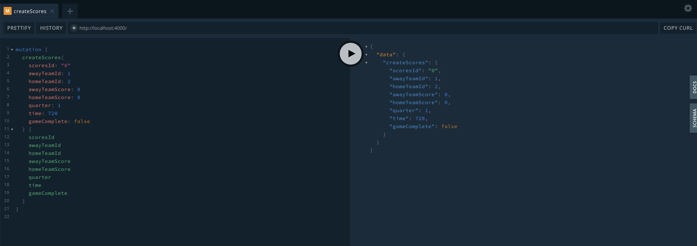

## Overview
- This scenario will show how we can leverage several technologies in tandem with the capabilities of Kafka,
and more specifically Kafka Streams.
- We will use Quarkus for most of the backend functionality. It will be used for our mock producer to produce events, 
for streams processing with our Kafka Streams topology, to create a WebSocket server and lastly to push those events from
Kafka Streams onto said WebSocket Server.
- A GraphQL API Server will be created using Node, Sequelize (Node-based ORM for various DBMS) using a local SQLite store, and Apollo-Server.
- A "frontend" component that using VueJS will serve two functions. Through Vue (and mostly Javascript) we will connect to 
the WebSocket and read messages. Vue-Apollo will then be used to query and perform mutations through the GraphQL API Server.
- **TO-DO/Work-in-Progress** Complete GraphQL subscriptions functionality portion for reactiveness on the state of the events.

## Scenario Prerequisites
**Java**
- Java 8+

**Maven**
- Maven will be needed for bootstrapping our application from the command-line and running
our Quarkus backend (mock producer, Kafka Streams topology, and WebSocket server) application.

**Node**
- We will need Node.js and more specifically npm for not only the GraphQL Server but for VueJS as well.

*The following are optional, you can tailor this to use a local Kafka cluster*

**OpenShift Container Platform**
- v4.4.x

**IBM Cloud Pak for Integration**
- CP4I2020.2.1

**IBM Event Streams**
- The section on use with Event Streams on CP4I assumes Event Streams v10. IF using a previous version such as ESv2019.4.2
there are some differences to how you would configure `application.properties` to establish a connection.


## Creating the Database

- Let's start by creating a new folder and our Node project. You can name the project whatever you like.

```shell
mkdir quarkus-kstreams-graphql
cd quarkus-kstreams-graphql
npm init -y
```

- Now we need to add the Node packages we'll need.

```shell
npm install sequelize sequelize-cli sqlite3 --save
```

- We will now need to use the Sequelize CLI to help scaffold out the project.

```shell
node_modules/.bin/sequelize init
```

- The following folders will be created.
    - `config`: contains a configuration file will help Sequelize with the connection to the database.
    - `models`: contains all models for the project. An index.js file which will integrate the models together.
    - `migrations`: contains all migration files.
    - `seeders`: contains all seed files.

- Open `config/config.json` and replace it with the following content

```json
// config/config.json
{
  "development": {
    "dialect": "sqlite",
    "storage": "./database.sqlite"
  }
}
```
    - What this file means is that the `dialect` is our Database of choice and `storage` is the location
    of our store.

- Create the database file.

```shell
touch database.sqlite
```

- Now that we have our initial database setup we can move to creating our models and migrations. Let's use 
the Sequelize CLI to create a `Scores` model.

```shell
node_modules/.bin/sequelize model:create --name Scores --attributes scoresId:string,awayTeamId:integer,homeTeamId:integer,awayTeamScore:integer,homeTeamScore:integer,quarter:integer,time:integer,gameComplete:boolean
```

- This will create a `scores.js` file inside the `models` folder as well as a `migrations` file. Open our migrations file
inside `migrations/XXXXXXXXX-create-scores.js`. We need to make sure that our `scoresId` field is our primary key as well as the other fields
being un-nullable.

```json
'use strict';
module.exports = {
  up: async (queryInterface, Sequelize) => {
    await queryInterface.createTable('Scores', {
      scoresId: {
        type: Sequelize.STRING,
        allowNull: false,
        primaryKey: true
      },
      awayTeamId: {
        allowNull: false,
        type: Sequelize.INTEGER
      },
      homeTeamId: {
        allowNull: false,
        type: Sequelize.INTEGER
      },
      awayTeamScore: {
        allowNull: false,
        type: Sequelize.INTEGER
      },
      homeTeamScore: {
        allowNull: false,
        type: Sequelize.INTEGER
      },
      quarter: {
        allowNull: false,
        type: Sequelize.INTEGER
      },
      time: {
        allowNull: false,
        type: Sequelize.INTEGER
      },
      gameComplete: {
        allowNull: false,
        type: Sequelize.BOOLEAN
      },
      createdAt: {
        allowNull: false,
        type: Sequelize.DATE
      },
      updatedAt: {
        allowNull: false,
        type: Sequelize.DATE
      }
    });
  },
  down: async (queryInterface, Sequelize) => {
    await queryInterface.dropTable('Scores');
  }
};
```

- We will need to update the `scores.js` model as well.

```js
// models/scores.js

'use strict';
const {
  Model
} = require('sequelize');
module.exports = (sequelize, DataTypes) => {
  class Scores extends Model {
    /**
     * Helper method for defining associations.
     * This method is not a part of Sequelize lifecycle.
     * The `models/index` file will call this method automatically.
     */
    static associate(models) {
      // define association here
    }
  };
  Scores.init({
    scoresId: {
      type: DataTypes.STRING,
      primaryKey: true
    },
    awayTeamId: DataTypes.INTEGER,
    homeTeamId: DataTypes.INTEGER,
    awayTeamScore: DataTypes.INTEGER,
    homeTeamScore: DataTypes.INTEGER,
    quarter: DataTypes.INTEGER,
    time: DataTypes.INTEGER,
    gameComplete: DataTypes.BOOLEAN
  }, {
    sequelize,
    modelName: 'Scores',
  });
  return Scores;
};
```

- Run the migrations

```shell
node_modules/.bin/sequelize db:migrate
```


- **TO-DO** After implementing a many-to-many join for the Kafka Streams topology for data enrichment will need to 
create another model and specify relationships (and inverse relationships) between the new models.


## Creating the GraphQL API Server

- Now that we have our database set up it's time to create the GraphQL API Server using Apollo Server. install
the necessary packages.

```shell
npm install apollo-server graphql
```

- Once done let's create a `src` folder as well as an `index.js` file with the following content.

```js
// src/index.js

const { ApolloServer } = require('apollo-server')
const typeDefs = require('./schema')
const resolvers = require('./resolvers')
const models = require('../models')

const server = new ApolloServer({
  typeDefs,
  resolvers,
  context: { models }
})

server
  .listen()
  .then(({ url }) => console.log('Server is running on localhost:4000'))
```

- Here, we create a new instance of Apollo Server. We then pass to it schema and resolvers (both which we’ll create shortly). 
We also pass the models as the context to the Apollo Server. This will allow us to have access to the models from our resolvers.

### GraphQL Schema 

*A GraphQL schema is used to define the functionality a GraphQL API would have. A GraphQL schema is comprised of 
a hierarchy of types with fields that are populated from your back-end data stores. The schema also outlines what
functionality (queries, mutations, subscriptions) the clients will have access to when executing against your GraphQL Server. *


- Time to define our GraphQL Schema. Create `schema.js` within the `src` folder.

```js
// src/schema.js

const { gql } = require('apollo-server')

const typeDefs = gql`
    type Scores {
        scoresId: String!
        awayTeamId: Int!
        homeTeamId: Int!
        awayTeamScore: Int!
        homeTeamScore: Int!
        quarter: Int!
        time: Int!
        gameComplete: Boolean!
      }

    type Query {
        score(scoresId: String!): Scores
        allScores: [Scores!]!
    }

    type Mutation {
        createScores(
          scoresId: String!
          awayTeamId: Int!
          homeTeamId: Int!
          awayTeamScore: Int!
          homeTeamScore: Int!
          quarter: Int!
          time: Int!
          gameComplete: Boolean!
          ): Scores!

        deleteScores(scoresId: String!): String

        updateScores(
          scoresId: String!
          awayTeamId: Int!
          homeTeamId: Int!
          awayTeamScore: Int!
          homeTeamScore: Int!
          quarter: Int!
          time: Int!
          gameComplete: Boolean!
          ): String
        
    }
`

module.exports = typeDefs

```

- As you can tell this was written in gql or graph query language. We want to mirror our database as much as possible
so our types reflect that. Within the types we specify `Query` and `Mutation` for executions against our GraphQL API Server.


- It's time to create the `resolvers`. Resolvers define how the fields in a schema are executed.
Create a `resolvers.js` file inside the `src` directory and add the following code in it:

```js
// src/resolvers.js

const resolvers = {
    
    Query: {
        async score (root, { scoresId }, { models }) {
              return models.Scores.findByPk(scoresId)
        },
        async allScores (root, args, { models }) {
              return models.Scores.findAll()
        }
    },
    
    Mutation: {
        async createScores (root, { scoresId, awayTeamId, homeTeamId, awayTeamScore,
                                   homeTeamScore, quarter, time, gameComplete }, { models }) {
            return models.Scores.create({
                scoresId,
                awayTeamId,
                homeTeamId,
                awayTeamScore,
                homeTeamScore,
                quarter,
                time,
                gameComplete
              })
        },
        async deleteScores(root, { scoresId }, { models }) {
            models.Scores.destroy({
                where: {
                    scoresId: scoresId
                }
            })

            return `Score with ID: ${scoresId} deleted`
        },
        async updateScores(root, { scoresId, awayTeamId, homeTeamId, awayTeamScore,
                                   homeTeamScore, quarter, time, gameComplete }, { models }) {
                models.Scores.update({ 
                    awayTeamId: awayTeamId,
                    homeTeamId: homeTeamId,
                    awayTeamScore: awayTeamScore,
                    homeTeamScore: homeTeamScore,
                    quarter: quarter,
                    time: time,
                    gameComplete: gameComplete
                },
                {
                    where: {
                        scoresId: scoresId
                    }
                }  
            )

            return `Score with ID: ${scoresId} updated`
        }
    },

}

module.exports = resolvers

```

- The `score` mutation does a single lookup within our model context by primary key and `allScores` is basically a `select * from Scores`.
The `createScores` mutation accepts all the fields and creates a new record in the database with the supplied details. 
It will then return the newly created user. `updateScores` mutation will update all the fields matching the provided scoresId. 
The equivalent of a SQL statement such as an update where scoresId = x. 


- **TO-DO** Will need to update resolvers.js to accomodate for the relationships between future models.


** Testing the GraphQL API Server

- Start the GraphQL API Server with the following command:

```shell
node src/index.js
```

- Open `localhost:4000` and let's test out the functionality of the GraphQL API.

```gql
mutation {
  createScores(
    scoresId: "0"
    awayTeamId: 1
    homeTeamId: 2
    awayTeamScore: 0
    homeTeamScore: 0
    quarter: 1
    time: 720
    gameComplete: false
  ) {
    scoresId
    awayTeamId
    homeTeamId
    awayTeamScore
    homeTeamScore
    quarter
    time
    gameComplete
  }
}
```

- Submit the mutation and you should see the following result.




## Bootstrapping the Quarkus Application

- 