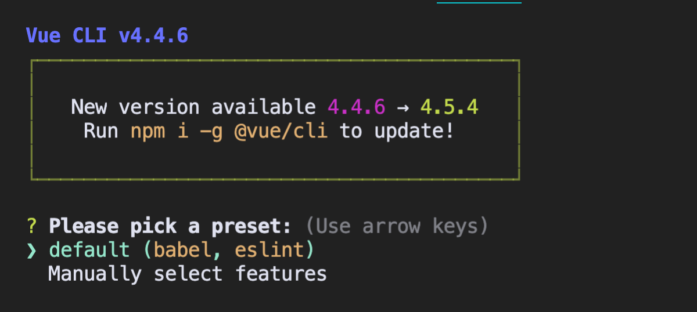

## Overview
- This scenario will show how we can leverage several technologies in tandem with the capabilities of Kafka,
and more specifically Kafka Streams.
- We will use Quarkus for most of the backend functionality. It will be used for our mock producer to produce events, 
for streams processing with our Kafka Streams topology, to create a WebSocket server and lastly to push those events from
Kafka Streams onto said WebSocket Server.
- A GraphQL API Server will be created using Node (Apollo Server)
- The database for which the GraphQL API will hook up to will use Sequelize (Node-based ORM for various DBMS) using a local SQLite store, and Apollo-Server.
- A "frontend" component that using VueJS will serve two functions. Through Vue (and mostly Javascript) we will connect to 
the WebSocket and read messages. Vue-Apollo will then be used to query and perform mutations through the GraphQL API Server.
- **TO-DO/Work-in-Progress** Complete GraphQL subscriptions functionality portion for reactiveness on the state of the events.

## Scenario Prerequisites
**Java**
- Java 8+

**Maven**
- Maven will be needed for bootstrapping our application from the command-line and running
our Quarkus backend (mock producer, Kafka Streams topology, and WebSocket server) application.

**Node**
- We will need Node.js and more specifically npm for not only the GraphQL Server but for VueJS as well.

**VueJS CLI**
- If you don't already have it installed as long as you have npm you can install it with the following command:

```shell
npm install -g @vue/cli
```

*The following are optional, you can tailor this to use a local Kafka cluster*

**OpenShift Container Platform**
- v4.4.x

**IBM Cloud Pak for Integration**
- CP4I2020.2.1

**IBM Event Streams**
- The section on use with Event Streams on CP4I assumes Event Streams v10. IF using a previous version such as ESv2019.4.2
there are some differences to how you would configure `application.properties` to establish a connection.


## Bootstrapping the Quarkus Application

- Let's use the Maven CLI to bootstrap our Quarkus project which we will use for our Kafka needs. Replace `{xxxxx}` with 
your choosing.

```shell
mvn io.quarkus:quarkus-maven-plugin:1.6.1.Final:create \
    -DprojectGroupId={com.ibm} \
    -DprojectArtifactId={quarkus-kstreams-graphql} \
    -Dextensions="kafka,kafka-streams,resteasy-jsonb,quarkus-kafka-streams,undertow-websockets"
```
- Now that we have our project, we need to first create our Plain Old Java Object (POJO) class which will be used as the basis
for how our events will be serialized and deserialized. Create the following folder structure as well as the class. Again make 
sure that what comes after `src/main/java/xxx/xxxx` is of your choosing.

`src/main/java/com/ibm/domain/Scores.java`

- Paste the following content.

```java
package com.ibm.domain;

public class Scores {

    public String scoreId;
    public int awayTeamId;
    public int homeTeamId;
    public int awayTeamScore;
    public int homeTeamScore;
    public int quarter;
    public int time;
    public boolean gameComplete;

    public Scores() {

    }

    public Scores(String scoreId, int awayTeamId, int homeTeamId, int awayTeamScore, 
                  int homeTeamScore, int quarter, int time, boolean gameComplete) {

        this.scoreId = scoreId;
        this.awayTeamId = awayTeamId;
        this.homeTeamId = homeTeamId;
        this.awayTeamScore = awayTeamScore;
        this.homeTeamScore = homeTeamScore;
        this.quarter = quarter;
        this.time = time;
        this.gameComplete = gameComplete;
    }
}
```

- Great we now have our base Quarkus application.

## Adding a MicroProfile Reactive Messaging Producer to the Quarkus Application

- The basis for the Quarkus application is created and now we need some way to generate events/data to the Kafka Topic. Create 
the Producer java file along with the infrastructure folder like so -

`src/main/java/com/ibm/infrastructure/Producer.java`

- Paste the following into the `Produer.java` file - 

```java
package com.ibm.infrastructure;

import java.util.Random;
import java.util.concurrent.TimeUnit;

import javax.enterprise.context.ApplicationScoped;

import org.eclipse.microprofile.reactive.messaging.Outgoing;

import io.reactivex.Flowable;
import io.smallrye.reactive.messaging.kafka.KafkaRecord;

import com.ibm.domain.*;


@ApplicationScoped
public class Producer {
    // Start a game between an away team and an home team. Starts at 1st quarter, and 12 minutes (720 seconds) for time.
    // This producer will constantly decrement the time/update the score. When the time reaches 00:00 the quarter
    // will increment. When the game reaches the 4th quarter and 00:00, the game is completed.

    Scores mockScore = new Scores("0", 1, 2, 0, 0, 1, 720, false);
    private Random random = new Random();

    @Outgoing("mock-messages")
    public Flowable<KafkaRecord<String, Scores>> produceMock() {
        return Flowable.interval(5, TimeUnit.SECONDS)
                       .map(tick -> {
                            return runGame(mockScore);
                        });
    }

    public KafkaRecord<String, Scores> runGame(Scores mock) {
        
        if (mock.quarter < 5 && mock.time > 0) {
            mock.time -= 20;
            mock.awayTeamScore = calculateScore(mock.awayTeamScore);
            mock.homeTeamScore = calculateScore(mock.homeTeamScore);

            if (mock.quarter < 4 && mock.time == 0) {
                mock.quarter += 1;
                mock.time = 720;
            }
        }

        // Game is finished
        if (mock.quarter == 4 && mock.time == 0) {
            mock.gameComplete = true;
        }

        return KafkaRecord.of(mock.scoreId, mock);
    }

    public int calculateScore (int score) {
        // randomly choose between a two pointer or a three pointer.
        // Then calculate with a percentage. 0 for two pointer, 1 for three.
        // Two is 45% and three is 32%. 
        int points = 0;
        int shotSelection = random.nextInt(2);
        float shotPercentage = random.nextFloat();

        if (shotSelection == 0) {
            if (shotPercentage <= 0.45) {
                points = 2;
            }
        }

        else if (shotSelection == 1) {
            if (shotPercentage <= 0.32) {
                points = 3;
            }
        }

        return score + points;
    }
}
```
- Explanation of a few key components:
    - We create a `mockScore` Scores object with a few values.
    - `@Outgoing("mock-messages")` is how MP Reactive Messaging will produce events. The `Outgoing` annotation does what it sounds
    like. There's an `Incoming` annotation for consuming as well. In this example `"mock-messages"` is the name of the Channel and is
    how it knows where to produce messages to. By default with the Kafka connector, the name of the Kafka topic that will be used is the 
    name of the Channel, but you can specify this to your liking in the `application.properties` file that we will get to later.
    - The return of the `produceMock()` function is a RxJava2 Flowable wrapped around a KafkaRecord with key String and Value being
    a Scores object. 

- We will now need to update our `application.properties` files so that our Quarkus application will have the proper configurations
to connect to the various systems. Go to `src/main/resources/application.properties` and paste the following: 

```properties
quarkus.http.port=8085
quarkus.log.console.enable=true
quarkus.log.console.level=INFO

# Base Reactive Messaging Connection Details
mp.messaging.connector.smallrye-kafka.bootstrap.servers=${BOOTSTRAP_SERVERS}
mp.messaging.connector.smallrye-kafka.security.protocol=SASL_SSL
mp.messaging.connector.smallrye-kafka.ssl.protocol=TLSv1.2
mp.messaging.connector.smallrye-kafka.sasl.mechanism=SCRAM-SHA-512
mp.messaging.connector.smallrye-kafka.sasl.jaas.config=org.apache.kafka.common.security.scram.ScramLoginModule required \
                username=${SCRAM_USERNAME} \
                password=${SCRAM_PASSWORD};
mp.messaging.connector.smallrye-kafka.ssl.truststore.location=${CERT_LOCATION}
mp.messaging.connector.smallrye-kafka.ssl.truststore.password=${CERT_PASSWORD}
mp.messaging.connector.smallrye-kafka.ssl.truststore.type=PKCS12

# Initial mock JSON message producer configuration
mp.messaging.outgoing.mock-messages.connector=smallrye-kafka
mp.messaging.outgoing.mock-messages.topic=${START_TOPIC_NAME}
mp.messaging.outgoing.mock-messages.group.id=scores-mock-producer
mp.messaging.outgoing.mock-messages.value.serializer=io.quarkus.kafka.client.serialization.JsonbSerializer


# Quarkus Kafka Streams configuration settings
quarkus.kafka-streams.bootstrap-servers=${BOOTSTRAP_SERVERS}
quarkus.kafka-streams.application-id=websocket-stream-local
quarkus.kafka-streams.application-server=localhost:8085
quarkus.kafka-streams.topics=${START_TOPIC_NAME},${ONGOING_TOPIC_NAME},${COMPLETE_TOPIC_NAME}
quarkus.kafka-streams.health.enabled=true
quarkus.kafka-streams.security.protocol=SASL_SSL
quarkus.kafka-streams.ssl.protocol=TLSv1.2
quarkus.kafka-streams.sasl.mechanism=SCRAM-SHA-512
quarkus.kafka-streams.sasl.jaas.config=org.apache.kafka.common.security.scram.ScramLoginModule required \
                username=${SCRAM_USERNAME} \
                password=${SCRAM_PASSWORD};
quarkus.kafka-streams.ssl.truststore.location=${CERT_LOCATION}
quarkus.kafka-streams.ssl.truststore.password=${CERT_PASSWORD}
quarkus.kafka-streams.ssl.truststore.type=PKCS12


# pass-through options
kafka-streams.cache.max.bytes.buffering=10240
kafka-streams.commit.interval.ms=1000
kafka-streams.metadata.max.age.ms=500
kafka-streams.auto.offset.reset=latest
kafka-streams.metrics.recording.level=DEBUG
```

- The top half with properties prefixed with `mp.messaging.connector.smallrye-kafka.` is what we're currently implementing. 
    - The first chunk is for actual connection to an IBM Event Streams v10 instance by providing bootstrap and various security certificates.
    - `mp.messaging.outgoing.mock-messages.topic` is how we're changing our Channel from our `Outgoing` annotation earlier to use a specific 
    Kafka topic name instead of just the Channel name which is `mock-messages` in this example. 
    - a `group.id` is provided for uniqueness.
    - the `value.serializer` property is provided by using the resteasy JsonbSerializer for serializing our records into JSON format.

- Most of the `quarkus.kafka-streams.` settings are self-explanatory enough due to their similary to the MP Reactive Messaging ones 
but we will talk about that in a bit.


## Creating the WebSocket Server

- We have the first portion of the scenario where we are producing events to a Kafka Topic. Before we can implement our
Kafka Streams topology that will send those messages to a WebSocket Server... we need to first create said WebSocket. For that
we will be using Undertow WebSockets.

- Create a new file named `OngoingWebSocketServer.java` within `src/main/com/ibm/java/infrastructure`. 
You can of course name this to something else. Paste the following content: 

```java
package com.ibm.infrastructure;

import java.util.Collections;
import java.util.Set;
import java.util.concurrent.ConcurrentHashMap;

import javax.enterprise.context.ApplicationScoped;
import javax.websocket.CloseReason;
import javax.websocket.OnClose;
import javax.websocket.OnOpen;
import javax.websocket.Session;
import javax.websocket.server.ServerEndpoint;

import org.slf4j.Logger;
import org.slf4j.LoggerFactory;


@ServerEndpoint("/ongoing")
@ApplicationScoped
public class OngoingWebSocketServer {

    private static final Logger LOG = LoggerFactory.getLogger( OngoingWebSocketServer.class );

    private static final Set<Session> sessions = Collections.newSetFromMap( new ConcurrentHashMap<>() );

    @OnOpen
    public void open(Session session) {
        LOG.info( "Opening session: " + session.getId() );
        sessions.add(session);
    }

    @OnClose
    public void close(Session session, CloseReason c) {
        sessions.remove( session );
        LOG.info( "Closing: " + session.getId() );
    }

    public Set<Session> getSessions() {
        return sessions;
    }
}
```

- Key things of note:
    - With the `@ServerEndpoint` annotation, this will append the field onto WebSocket URI. For example if our application
    server is running on `localhost:8085` then the WS URI will be at `ws://localhost:8085/ongoing/`. 
    - Sessions are added onto a hash map on connection and removed with close.
    - The actual writing to the WebSocket will be done in our Kafka Streams topology a bit later.

- Our WebSocket Server is now setup.


## Creating the Kafka Streams Topology

- We have the first two major portions of the Quarkus application made and now we need arguably the most important, the Kafka Streams
topology. This will be responsible for getting our events from the Kafka Topic, process them, and then off they go to the WebSocket.

- Create the `BasketballTopology.java` file which you can name whatever you would like inside `src/main/java/com/ibm/domain/` and 
paste the following:

```java
package com.ibm.domain;

import java.io.IOException;

import javax.enterprise.context.ApplicationScoped;
import javax.enterprise.inject.Produces;
import javax.inject.Inject;

import org.eclipse.microprofile.config.inject.ConfigProperty;

import org.apache.kafka.common.serialization.Serdes;
import org.apache.kafka.streams.StreamsBuilder;
import org.apache.kafka.streams.Topology;
import org.apache.kafka.streams.kstream.Consumed;
import org.apache.kafka.streams.kstream.KStream;
import org.apache.kafka.streams.kstream.Produced;

import io.quarkus.kafka.client.serialization.JsonbSerde;

import com.fasterxml.jackson.databind.ObjectMapper;
import com.ibm.infrastructure.*;


@ApplicationScoped
public class BasketballTopology {

    // The topology will have a KStream for the constantly updating game score, it will then 
    // do a join by teamId on a KTable and enrich the message with the teamNames. It will then
    // output this to a topic.
    @ConfigProperty(name = "START_TOPIC_NAME")
    private String INCOMING_TOPIC;

    @ConfigProperty(name = "ONGOING_TOPIC_NAME")
    private String ONGOING_TOPIC;

    @ConfigProperty(name = "COMPLETE_TOPIC_NAME")
    private String COMPLETE_TOPIC;

    @Inject
    OngoingWebSocketServer ongoingEndPoint;

    @Produces
    public Topology buildTopology() {

        StreamsBuilder builder = new StreamsBuilder();

        JsonbSerde<Scores> scoresSerde = new JsonbSerde<>(Scores.class);

        ObjectMapper obj = new ObjectMapper();

        KStream<String, Scores> ongoingScoresStream = builder.stream(
            INCOMING_TOPIC,
            Consumed.with(Serdes.String(), scoresSerde)
        );
        
        KStream<String, Scores>[] branches = ongoingScoresStream.branch(
            (key, scores) -> scores.gameComplete,
            (key, scores) -> !scores.gameComplete
        );

        branches[0].to(
            COMPLETE_TOPIC,
            Produced.with(Serdes.String(), scoresSerde)
        );

        branches[1].peek((key, scores) -> {
            ongoingEndPoint.getSessions().forEach(s -> {
                try {
                    s.getBasicRemote().sendText(obj.writeValueAsString(scores));
                }
                catch (IOException e) {
                    throw new RuntimeException(e);
                }
            });
        });

        branches[1].to(
            ONGOING_TOPIC,
            Produced.with(Serdes.String(), scoresSerde)
        );

        return builder.build();
    }
}
```

- Some key things to note:
    - We will be using environment variables to supply the values of our topic names thus the `@configProperty` annotations.
    - We perform a dependency injection with the `@Injection` annotation on a new `OngoingWebSocketServer`.
    - The Kafka Streams DSL API is being used with StreamsBuilder.
    - A scoresSerde is created for the purposes of serializing and deserializing Scores objects wrapped with the JsbonSerde class.
    - The `ongoingScoresStream` KStream is created by consuming from `INCOMING_TOPIC` with a String key serde and a Scores value serde. 
    - Next, we branch the stream. `branches[0]` will get events/records where the `gameComplete` boolean flag is true and `branches[1]` will get
    them with false (meaning game is not complete).
    - `branches[0]` will be produced and persisted with `COMPLETE_TOPIC`.
    - `branches[1]` will have events streamed where games are incomplete. We use the `peek` operator to send these events to our WebSocket server.
    Our `Scores` POJO is converted to String and then sent to each session connected to the WebSocket. Lastly, this stream is also
    sent to an `OUTGOING_TOPIC` for persistence.

- Great! We're now done with the Quarkus portion. 

- **TO-DO** Add more functionality to the topology for enrichment.


## Creating the Database

- Let's start by creating a new folder inside the root directory for our Node project. You can name the project whatever you like.
`quarkus-kstreams-graphql/graphql-server/`

```shell
mkdir graphql-server
cd graphql-server
npm init -y
```

- Now we need to add the Node packages we'll need.

```shell
npm install sequelize sequelize-cli sqlite3 --save
```

- We will now need to use the Sequelize CLI to help scaffold out the project.

```shell
node_modules/.bin/sequelize init
```

- The following folders will be created.
    - `config`: contains a configuration file will help Sequelize with the connection to the database.
    - `models`: contains all models for the project. An index.js file which will integrate the models together.
    - `migrations`: contains all migration files.
    - `seeders`: contains all seed files.

- Open `config/config.json` and replace it with the following content

```json
// config/config.json

{
  "development": {
    "dialect": "sqlite",
    "storage": "./database.sqlite"
  }
}
```

- What this file means is that the `dialect` is our Database of choice and `storage` is the location
of our store.

- Next, create the database file.

```shell
touch database.sqlite
```

- Now that we have our initial database setup we can move to creating our models and migrations. Let's use 
the Sequelize CLI to create a `Scores` model.

```shell
node_modules/.bin/sequelize model:create --name Scores --attributes scoresId:string,awayTeamId:integer,homeTeamId:integer,awayTeamScore:integer,homeTeamScore:integer,quarter:integer,time:integer,gameComplete:boolean
```

- This will create a `scores.js` file inside the `models` folder as well as a `migrations` file. Open our migrations file
inside `migrations/XXXXXXXXX-create-scores.js`. We need to make sure that our `scoresId` field is our primary key as well as the other fields
being un-nullable.

```js
// migrations/XXXXXXXXX-create-scores.js

'use strict';
module.exports = {
  up: async (queryInterface, Sequelize) => {
    await queryInterface.createTable('Scores', {
      scoresId: {
        type: Sequelize.STRING,
        allowNull: false,
        primaryKey: true
      },
      awayTeamId: {
        allowNull: false,
        type: Sequelize.INTEGER
      },
      homeTeamId: {
        allowNull: false,
        type: Sequelize.INTEGER
      },
      awayTeamScore: {
        allowNull: false,
        type: Sequelize.INTEGER
      },
      homeTeamScore: {
        allowNull: false,
        type: Sequelize.INTEGER
      },
      quarter: {
        allowNull: false,
        type: Sequelize.INTEGER
      },
      time: {
        allowNull: false,
        type: Sequelize.INTEGER
      },
      gameComplete: {
        allowNull: false,
        type: Sequelize.BOOLEAN
      },
      createdAt: {
        allowNull: false,
        type: Sequelize.DATE
      },
      updatedAt: {
        allowNull: false,
        type: Sequelize.DATE
      }
    });
  },
  down: async (queryInterface, Sequelize) => {
    await queryInterface.dropTable('Scores');
  }
};
```

- We will need to update the `scores.js` model as well.

```js
// models/scores.js

'use strict';
const {
  Model
} = require('sequelize');
module.exports = (sequelize, DataTypes) => {
  class Scores extends Model {
    /**
     * Helper method for defining associations.
     * This method is not a part of Sequelize lifecycle.
     * The `models/index` file will call this method automatically.
     */
    static associate(models) {
      // define association here
    }
  };
  Scores.init({
    scoresId: {
      type: DataTypes.STRING,
      primaryKey: true
    },
    awayTeamId: DataTypes.INTEGER,
    homeTeamId: DataTypes.INTEGER,
    awayTeamScore: DataTypes.INTEGER,
    homeTeamScore: DataTypes.INTEGER,
    quarter: DataTypes.INTEGER,
    time: DataTypes.INTEGER,
    gameComplete: DataTypes.BOOLEAN
  }, {
    sequelize,
    modelName: 'Scores',
  });
  return Scores;
};
```

- Run the migrations

```shell
node_modules/.bin/sequelize db:migrate
```


- **TO-DO** After implementing a many-to-many join for the Kafka Streams topology for data enrichment will need to 
create another model and specify relationships (and inverse relationships) between the new models.


## Creating the GraphQL API Server

- Now that we have our database set up it's time to create the GraphQL API Server using Apollo Server. install
the necessary packages.

```shell
npm install apollo-server graphql --save
```

- Once done let's create a `src` folder as well as an `index.js` file with the following content.

```js
// src/index.js

const { ApolloServer } = require('apollo-server')
const typeDefs = require('./schema')
const resolvers = require('./resolvers')
const models = require('../models')

const server = new ApolloServer({
  typeDefs,
  resolvers,
  context: { models }
})

server
  .listen()
  .then(({ url }) => console.log('Server is running on localhost:4000'))
```

- Here, we create a new instance of Apollo Server. We then pass to it schema and resolvers (both which we’ll create shortly). 
We also pass the models as the context to the Apollo Server. This will allow us to have access to the models from our resolvers.

### GraphQL Schema 

*A GraphQL schema is used to define the functionality a GraphQL API would have. A GraphQL schema is comprised of 
a hierarchy of types with fields that are populated from your back-end data stores. The schema also outlines what
functionality (queries, mutations, subscriptions) the clients will have access to when executing against your GraphQL Server. *


- Time to define our GraphQL Schema. Create `schema.js` within the `src` folder.

```js
// src/schema.js

const { gql } = require('apollo-server')

const typeDefs = gql`
    type Scores {
        scoresId: String!
        awayTeamId: Int!
        homeTeamId: Int!
        awayTeamScore: Int!
        homeTeamScore: Int!
        quarter: Int!
        time: Int!
        gameComplete: Boolean!
      }

    type Query {
        score(scoresId: String!): Scores
        allScores: [Scores!]!
    }

    type Mutation {
        createScores(
          scoresId: String!
          awayTeamId: Int!
          homeTeamId: Int!
          awayTeamScore: Int!
          homeTeamScore: Int!
          quarter: Int!
          time: Int!
          gameComplete: Boolean!
          ): Scores!

        deleteScores(scoresId: String!): String

        updateScores(
          scoresId: String!
          awayTeamId: Int!
          homeTeamId: Int!
          awayTeamScore: Int!
          homeTeamScore: Int!
          quarter: Int!
          time: Int!
          gameComplete: Boolean!
          ): String
        
    }
`

module.exports = typeDefs

```

- As you can tell this was written in gql or graph query language. We want to mirror our database as much as possible
so our types reflect that. Within the types we specify `Query` and `Mutation` for executions against our GraphQL API Server.


- It's time to create the `resolvers`. Resolvers define how the fields in a schema are executed.
Create a `resolvers.js` file inside the `src` directory and add the following code in it:

```js
// src/resolvers.js

const resolvers = {
    
    Query: {
        async score (root, { scoresId }, { models }) {
              return models.Scores.findByPk(scoresId)
        },
        async allScores (root, args, { models }) {
              return models.Scores.findAll()
        }
    },
    
    Mutation: {
        async createScores (root, { scoresId, awayTeamId, homeTeamId, awayTeamScore,
                                   homeTeamScore, quarter, time, gameComplete }, { models }) {
            return models.Scores.create({
                scoresId,
                awayTeamId,
                homeTeamId,
                awayTeamScore,
                homeTeamScore,
                quarter,
                time,
                gameComplete
              })
        },
        async deleteScores(root, { scoresId }, { models }) {
            models.Scores.destroy({
                where: {
                    scoresId: scoresId
                }
            })

            return `Score with ID: ${scoresId} deleted`
        },
        async updateScores(root, { scoresId, awayTeamId, homeTeamId, awayTeamScore,
                                   homeTeamScore, quarter, time, gameComplete }, { models }) {
                models.Scores.update({ 
                    awayTeamId: awayTeamId,
                    homeTeamId: homeTeamId,
                    awayTeamScore: awayTeamScore,
                    homeTeamScore: homeTeamScore,
                    quarter: quarter,
                    time: time,
                    gameComplete: gameComplete
                },
                {
                    where: {
                        scoresId: scoresId
                    }
                }  
            )

            return `Score with ID: ${scoresId} updated`
        }
    },

}

module.exports = resolvers

```

- The `score` mutation does a single lookup within our model context by primary key and `allScores` is basically a `select * from Scores`.
The `createScores` mutation accepts all the fields and creates a new record in the database with the supplied details. 
It will then return the newly created user. `updateScores` mutation will update all the fields matching the provided scoresId. 
The equivalent of a SQL statement such as an update where scoresId = x. 


- **TO-DO** Will need to update resolvers.js to accomodate for the relationships between future models.


## Testing the GraphQL API Server

- Start the GraphQL API Server with the following command:

```shell
node src/index.js
```

- Open `localhost:4000` and let's test out the functionality of the GraphQL API.

```gql
mutation {
  createScores(
    scoresId: "0"
    awayTeamId: 1
    homeTeamId: 2
    awayTeamScore: 0
    homeTeamScore: 0
    quarter: 1
    time: 720
    gameComplete: false
  ) {
    scoresId
    awayTeamId
    homeTeamId
    awayTeamScore
    homeTeamScore
    quarter
    time
    gameComplete
  }
}
```

- Submit the mutation and you should see the following result.


## Creating the Client Application with VueJS and Vue-Apollo

- We have all the building blocks of the scenario now - a mock producer sending events to a Kafka Topic, a Kafka Streams Topology 
that will process and stream events to a WebSocket server, a local SQLite database, and a GraphQL API Server that will perform
queries on mutations backed with said SQLite database. We will now have a VueJS application that will handle the client side connection
and process messages received from the WebSocket. With Vue-Apollo it will either perform a `createScores` mutation or an `updateScores`
mutation depending on if the query with `scoresId` primary key returns null or not.

- Now go back to the root of our `quarkus-kstreams-graphql` project folder. Bootstrap our Vue application with the following command. Again
you can replace `{vue}` with a name of your choosing but I will be using `vue` for simplicity's sake.

```shell
vue create {vue}
```

- Choose the default settings.



- Change directories into the newly created Vue project.

```shell
cd vue
```

- You can test the newly created boilerplate Vue project by going to `localhost:8080` after running:

```shell
npm run serve
```

- Now we need to install the necessary dependencies for our Vue project for use with GraphQL.

```shell
npm install apollo-boost apollo-client apollo-link-http apollo-cache-inmemory vue-apollo graphql graphql-tag --save
```

- Now open `src/main.js` file and paste the following: 

```js
import Vue from 'vue'
import App from './App.vue'
import ApolloClient from "apollo-boost"
import VueApollo from "vue-apollo"


const apolloClient = new ApolloClient({
  uri: "http://localhost:4000/"
})

Vue.use(VueApollo)

const apolloProvider = new VueApollo({
  defaultClient: apolloClient,
  cache: new InMemoryCache(),
  connectToDevTools: true
})

Vue.config.productionTip = false

new Vue({
  render: h => h(App),
  apolloProvider
}).$mount('#app')
```

- Things of note:
    - The URI that the `apolloClient` is connecting to is the GraphQL API Server we created at `localhost:4000`
    - We're mounting the `App.vue` file.

- 